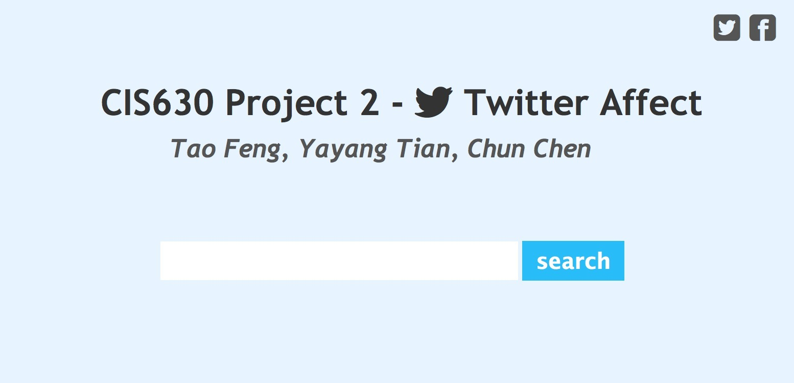
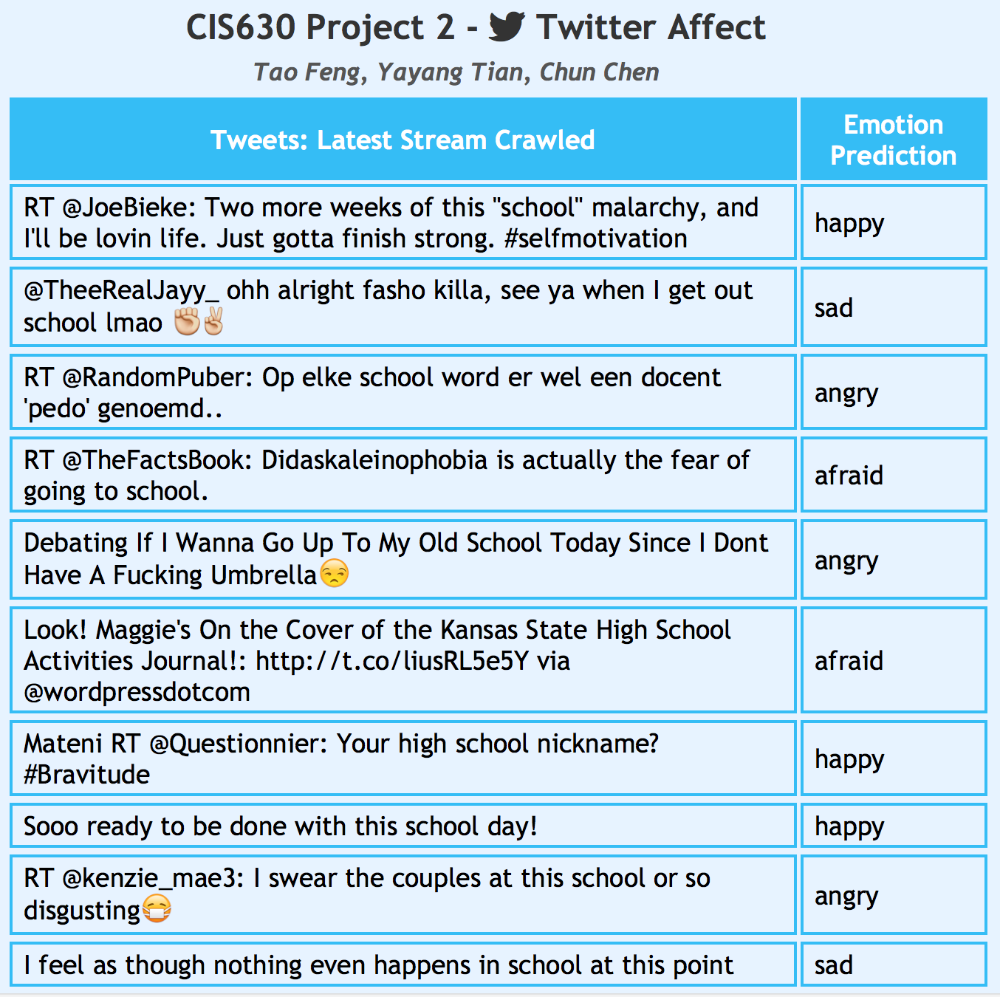

Twitter Social Web Mining
=========================

An innovative six-class classification model and web application that is able to predict sentiments of real-time tweets
around you based on keyword searched.
`Spring 2013`

## _About_
    
    Skills: Python, Django, Twitter Streaming API, machine learning, data mining
    Lexicon: Bingliu's List, MPQA, FrameNet, WordNet, list in Emotion Intelligence
    Course: CIS630, Advanced Natural Language Processing, Spring 2013, University of Pennsylvania
    Teamwork: Yayang Tian, Tao Feng, Chun Chen

## _Contribution_
1. Tweets Corpus: Presented a method for automatically collecting recent tweets with different emo- tions. Created a large tweets corpus consisting of five emotions: ”happy, sad, angry, afraid, ashamed”.
2. Six-class Classification Model: Adopted various methods for tweets affect classification and out- perform baseline approach by 21.197%. Conducted experimental evaluations on real-time Tweets and showed the importance for stemming, affect dictionary, smiley, information gain, and SVM in five-class classification.
3. Web Application: Build a web application that can classify and summarize emotions on Twitter in real-time based on user-specified keyword.

## _Snapshots_
1. This the the first page for users to enter keyword:

2. This is the second page displaying crawled tweets as well as their predicted emotions:

    
